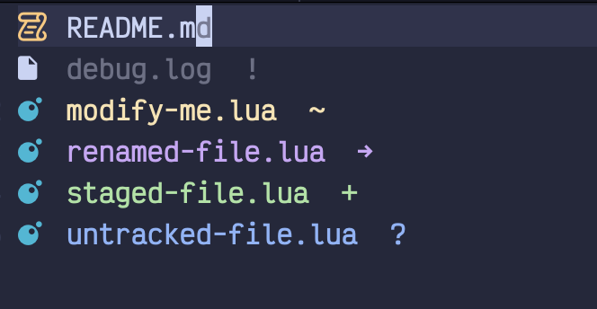
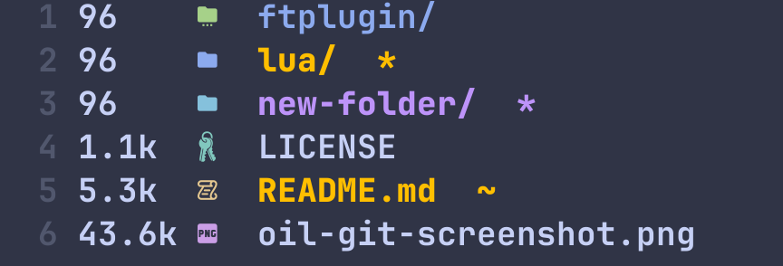

# oil-git.nvim

<div align="center">

[](https://github.com/malewicz1337/oil-git.nvim/actions/workflows/test.yml)
[](https://neovim.io)
[](https://www.lua.org)

[](LICENSE)
[](https://github.com/malewicz1337/oil-git.nvim/stargazers)
[](https://github.com/malewicz1337/oil-git.nvim/commits)

</div>

Git status integration for [oil.nvim](https://github.com/stevearc/oil.nvim) - colors file/directory names and adds status symbols.

> [!NOTE]
> **malewicz1337/oil-git.nvim** is the successor to `benomahony/oil-git.nvim`. It was created to provide a maintained, high-performance alternative with async support, directory highlighting, and debouncing.

<table>
  <tr>
    <td></td>
    <td></td>
  </tr>
</table>

## Features

- **File & directory highlighting** - Instant visual feedback based on git status.
- **Status symbols** - Customizable symbols (added, modified, deleted, etc.) at the end of lines.
- **Async & debounced** - Non-blocking execution ensures **zero lag even in massive repositories** with deep directory structures.
- **Smart Refresh** - Auto-updates on buffer entry, file operations, and after closing terminal toggles (like LazyGit).

## Installation

**lazy.nvim** (no setup required):

```lua
{ "malewicz1337/oil-git.nvim", dependencies = { "stevearc/oil.nvim" } }
```

<details>
<summary>With custom options (as oil.nvim dependency)</summary>

This is how I use the plugin in my config:

```lua
{
  "stevearc/oil.nvim",
  dependencies = {
    { "echasnovski/mini.icons", opts = {} },
    {
      "malewicz1337/oil-git.nvim",
      dependencies = { "stevearc/oil.nvim" },
      opts = {
        show_file_highlights = true,
        show_directory_highlights = false,
        show_ignored_files = true,
      },
    },
  },
  config = function()
    require("oil").setup({
      ...
    })
  end,
}
```
</details>

<details>
<summary>Other plugin managers</summary>

**Packer:**
```lua
use { "malewicz1337/oil-git.nvim", requires = { "stevearc/oil.nvim" } }
```

**vim-plug:**
```vim
Plug 'stevearc/oil.nvim'
Plug 'malewicz1337/oil-git.nvim'
```
</details>

## Configuration

All options with defaults:

```lua
require("oil-git").setup({
  debounce_ms = 50,
  show_file_highlights = true,
  show_directory_highlights = true,
  show_file_symbols = true,
  show_directory_symbols = true,
  show_ignored_files = false,       -- Show ignored file status
  show_ignored_directories = false, -- Show ignored directory status
  symbol_position = "eol",  -- "eol", "signcolumn", or "none"
  ignore_gitsigns_update = false,   -- Ignore GitSignsUpdate events (fallback for flickering)
  debug = false,            -- false, "minimal", or "verbose"

  symbols = {
    file = { added = "+", modified = "~", renamed = "->", deleted = "D",
             copied = "C", conflict = "!", untracked = "?", ignored = "o" },
    directory = { added = "*", modified = "*", renamed = "*", deleted = "*",
                  copied = "*", conflict = "!", untracked = "*", ignored = "o" },
  },

  -- Colors (only applied if highlight groups don't exist)
  highlights = {
    OilGitAdded = { fg = "#a6e3a1" },
    OilGitModified = { fg = "#f9e2af" },
    OilGitRenamed = { fg = "#cba6f7" },
    OilGitDeleted = { fg = "#f38ba8" },
    OilGitCopied = { fg = "#cba6f7" },
    OilGitConflict = { fg = "#fab387" },
    OilGitUntracked = { fg = "#89b4fa" },
    OilGitIgnored = { fg = "#6c7086" },
  },
})
```

## Git Status Reference

| Status | File Symbol | Color | Description |
|--------|-------------|-------|-------------|
| Added | `+` | Green | Staged new file |
| Modified | `~` | Yellow | Changed (staged/unstaged) |
| Renamed | `->` | Purple | Renamed file |
| Deleted | `D` | Red | Deleted file |
| Copied | `C` | Purple | Copied file |
| Conflict | `!` | Orange | Merge conflict |
| Untracked | `?` | Blue | New untracked file |
| Ignored | `o` | Gray | Ignored file |

### Directory Status Priority

Directories show the highest-priority status among their contents:

| Priority | Status | Description |
|----------|--------|-------------|
| 7 | Conflict | Merge conflicts need immediate attention |
| 6 | Modified | Staged or unstaged changes |
| 5 | Deleted | Deleted files |
| 4 | Added | New staged files |
| 3 | Renamed/Copied | Renamed or copied files |
| 2 | Untracked | New untracked files |
| 1 | Ignored | Only shown when `show_ignored_directories = true` |

## Usage

- `:lua require("oil-git").refresh()` - Manual refresh
- `:checkhealth oil-git` - Check plugin health

Status auto-refreshes on buffer enter, file operations, focus changes, and terminal close (LazyGit, etc.).

## Requirements

- Neovim >= 0.8
- [oil.nvim](https://github.com/stevearc/oil.nvim)
- Git

## License

[MIT](LICENSE)
